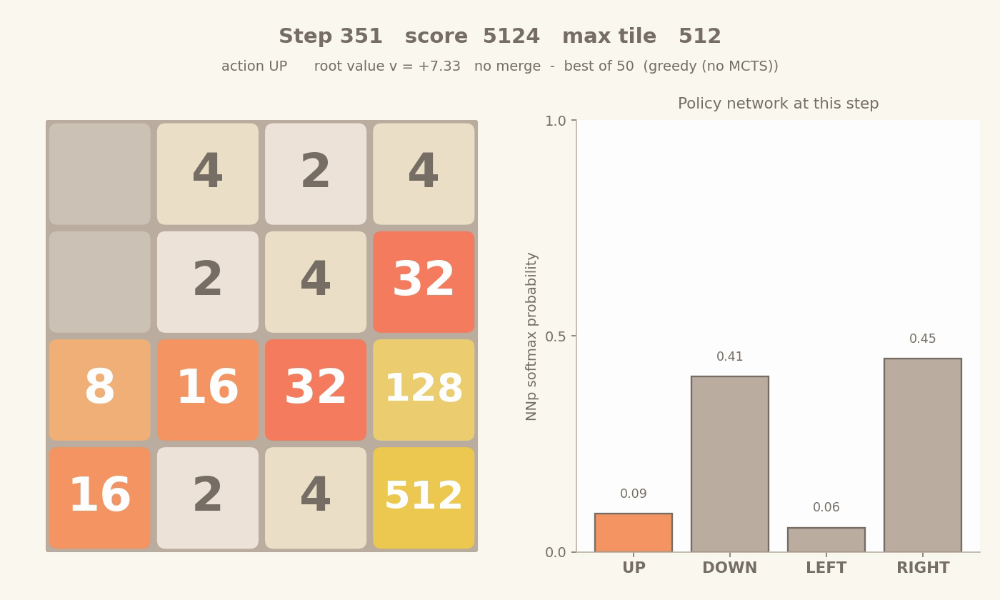

# MuZero knockoff — learning 2048 from scratch

An implementation of [MuZero](https://arxiv.org/abs/1911.08265). It is a model-based RL agent that learns to play **2048** without being told the rules. The agent learns its own world model in latent space, plans with MCTS through that model, and trains three neural networks via BPTT.

## Demo

[](runs/TwentyFortyEight_2026-04-18_18-34-16_viz/best_of_50.mp4)

*The agent reaches the **512 tile** with a score of 5304 over 368 moves. Click the thumbnail for the full MP4.*

## What it does

- Plays 2048 well by **planning in a learned latent space** — the search tree never touches the real game simulator
- Built around three small MLPs trained jointly:
  - **NNr** (representation): real board → latent state σ
  - **NNd** (dynamics): (σ, action) → (next σ, predicted reward)
  - **NNp** (prediction): σ → (value, policy)
- Plans with **u-MCTS** using PUCT in σ-space; trained end-to-end with **BPTT** through the unrolled dynamics

## Results

Champion: `runs/TwentyFortyEight_2026-04-19_19-29-54_champion.pkl`

| Agent | Avg max tile (1000 greedy games) | Best tile observed |
|---|---|---|
| Random baseline | ~111 | 256 |
| **Trained champion** | **195.3** | **512** |

The agent regularly reaches the 256 tile and breaks through to 512 in upper-tail games — without ever being told what a "merge" or a "tile spawn" is.

## How it works

```
                    ┌─ NNp ─→ (value, policy)
   state ─ NNr ─→ σ
                    └─ NNd ─→ (next σ, reward)   (with action input)
```

At every move the agent runs u-MCTS in σ-space: PUCT picks a leaf, NNd expands it (one batched call across all actions), the leaf rolls out `d_max` more NNd steps with NNp sampling actions, and the accumulated rollout reward + NNp leaf value gets backed up through the tree. The final action is sampled from the visit-count distribution under a temperature schedule (high early for exploration, low late for exploitation).

Training samples short windows from a replay buffer. Each window unrolls NNr → NNd → NNd → NNd → NNp through `roll_ahead` real actions and minimises:

```
loss = 0.25·MSE(value) + CE(policy, MCTS_visits) + MSE(reward)
```

The whole unroll is `vmap`-batched and differentiated in a single `jax.value_and_grad` pass with global gradient clipping, Adam, a cosine LR schedule, and persistent optimizer state across iterations.

## Repo layout

```
README.md                — this file
config.py                — all hyperparameters in one place
train_system.py          — main entry point: trains an agent end-to-end
rlm.py                   — RL manager: self-play loop, parallel workers, evaluation, leaderboard
worker.py                — picklable functions for parallel episode collection / evaluation
buffer.py                — episode replay buffer
baseline.py              — random-action baseline for comparison
visualize.py             — training-loss + policy-analysis plots
run_logger.py            — saves run artefacts (.pkl, .json, .png) under runs/
run_agent.py             — load a saved champion and watch one greedy game
viz_2048_play.py         — play one game and render an MP4 of the board + policy
best_2048.py             — play N games, render only the best one as MP4
hparam_optuna.py         — Bayesian (Optuna TPE) hyperparameter search
meta_shootout.py         — 1000-game shootout across all trial champions
run_overnight.sh         — one-shot wrapper: env setup + Optuna + shootout

game/
  ASM.py                 — bridge between real states and latent σ
  TwentyFortyEight.py    — the 2048 game (state, transitions, rewards)
nn/
  nn.py                  — small MLP (Flax NNX)
  NNManager.py           — owns NNr/NNd/NNp + the BPTT training step
mcts/
  mcts.py                — u-MCTS with PUCT in latent space
  node.py                — tree node with action stats

runs/                    — saved checkpoints, training plots, demo clip
environment.yml          — conda env spec (Python + JAX + Flax + Optuna + matplotlib)
```

## Run it yourself

```bash
# One-time setup
conda env create -f environment.yml
conda activate AI

# Train a fresh agent (uses settings from config.py)
python train_system.py

# Play 50 games with the saved champion and render the best one as an MP4
python best_2048.py runs/TwentyFortyEight_2026-04-19_19-29-54_champion.pkl 50

# Watch the champion play one greedy game (printed to stdout)
python run_agent.py runs/TwentyFortyEight_2026-04-19_19-29-54_champion.pkl
```

A full training run (10 iterations, 9 episodes/iter, 50 grad steps/iter, 3 parallel workers) takes ~25 minutes on a recent MacBook.

## Hyperparameter search

Settings were tuned with **Bayesian search** via [Optuna](https://optuna.org)'s TPE sampler. Each iteration's eval feeds back into the sampler, narrowing the prior over `learning_rate`, `c`, `d_max`, `dir_epsilon`, and `episodes_per_iter`. During training a top-K leaderboard tracks the best-evaluating checkpoints; after training each leaderboard entry plays 1000 games in a final shootout, and the highest-scoring one becomes the run's `_champion.pkl`.

```bash
./run_overnight.sh   # full pipeline: env → Optuna trials → 1000-game shootout
```

## References

- DeepMind's MuZero paper: [arXiv:1911.08265](https://arxiv.org/abs/1911.08265)
- Networks: [JAX](https://github.com/google/jax) + [Flax NNX](https://flax.readthedocs.io/en/latest/nnx/)
